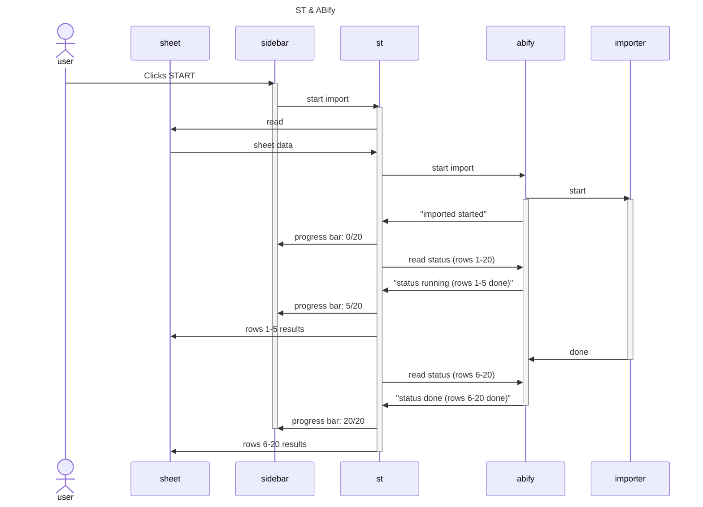

```mermaid
sequenceDiagram
title ST & ABify

actor user
participant sheet
participant sidebar
participant st
participant abify
participant importer

user->>sidebar:Clicks START
activate sidebar
sidebar->>st: start import
activate st

st->>sheet:read
sheet->>st:sheet data


st->>abify: start import
abify->>importer: start
activate abify
activate importer
abify->>st: "imported started"
st->>sidebar: progress bar: 0/20

st->>abify: read status (rows 1-20)
abify->>st: "status running (rows 1-5 done)"
st->>sidebar: progress bar: 5/20
st->>sheet: rows 1-5 results

importer->>abify: done
deactivate importer

st->>abify: read status (rows 6-20)

abify->>st: "status done (rows 6-20 done)"
deactivate abify
st->>sidebar: progress bar: 20/20
deactivate sidebar
st->>sheet: rows 6-20 results
deactivate st
```